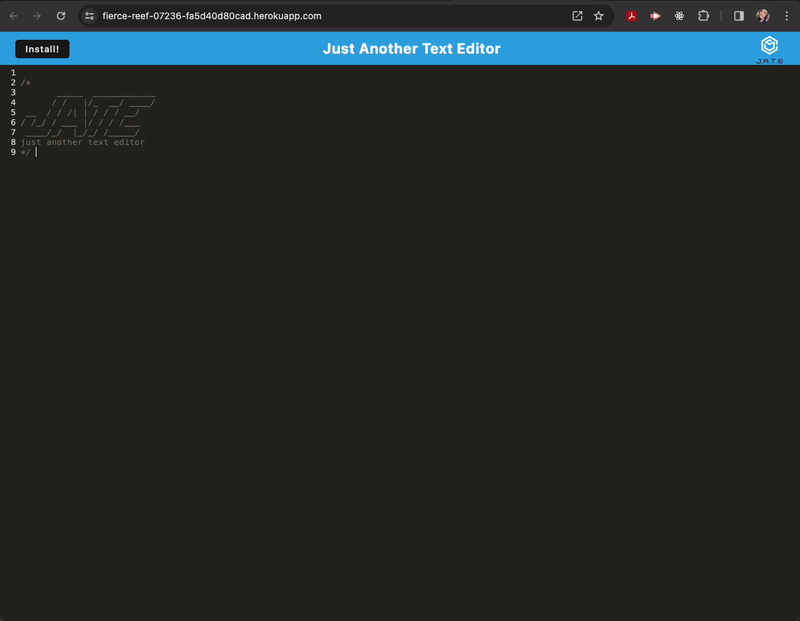

# J.A.T.E. Just Another Text Editor

## Description 
This PWA was created to create notes or code snippets with or without an internet connection. This was done using the webpack plugins to create the and build the progressive-web-app. Server was built using Express.js. 

Deployed application link: https://fierce-reef-07236-fa5d40d80cad.herokuapp.com/

Additionally, this application is easily downloadable onto the user's device. 
A demo gif can be found in the [Demo](#demo) section

## Table of Contents

- [Installation](#installation)
- [Usage](#usage)
- [Demo](#demo)
- [Credits](#credits)
- [License](#license)
- [How to Contribute](#how-to-contribute)

## Installation

This application needs npm packages to be installed and saved

```bash
npm install
```

## Usage

Start the application back-end and serve the client by running the following command from the root directory:

```javascript
$ npm run start
```

Once the application is running on the browser, it can be downloaded and used in the future with or without internet connection

## Demo

The following demo shows how to start the application and how to download it 

[]


## Credits

N/A

## License

This application is covered under [MIT](https://choosealicense.com/licenses/mit/) license

## How to Contribute

If you have any questions, comments, or concerns please feel free to reach me at beatz.bravo@gmail.com. If you would like to contribute to my project, you can find my repo on [github.com/Beabravo](https://www.github.com/Beabravo)
